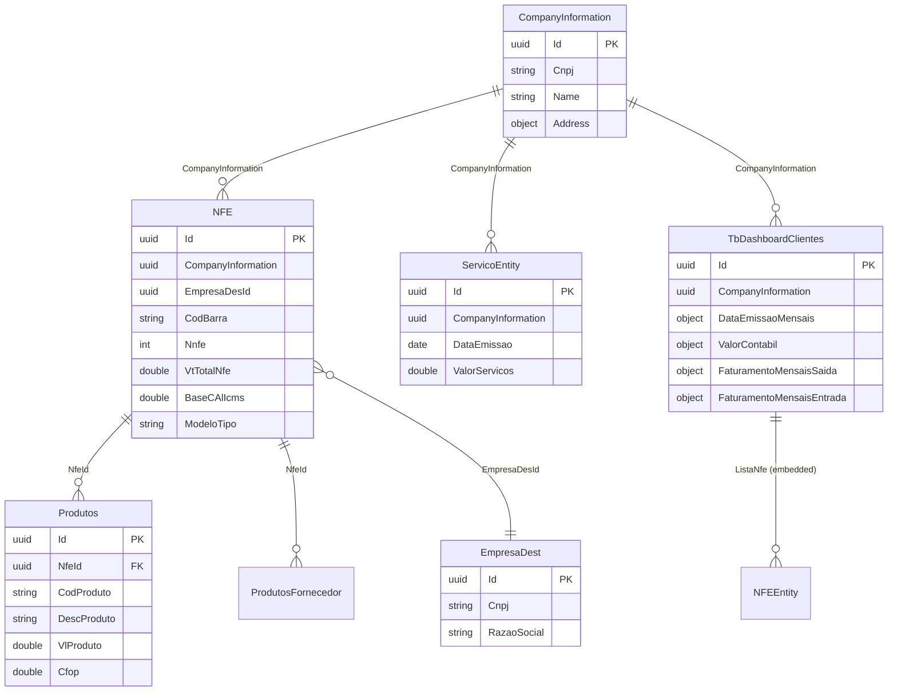

# Diagrama ER (Mermaid)

```mermaid
erDiagram
  CompanyInformation ||--o{ NFE : "CompanyInformation"
  CompanyInformation ||--o{ ServicoEntity : "CompanyInformation"
  CompanyInformation ||--o{ TbDashboardClientes : "CompanyInformation"

  NFE ||--o{ Produtos : "NfeId"
  NFE ||--o{ ProdutosFornecedor : "NfeId"
  NFE }o--|| EmpresaDest : "EmpresaDesId"

  TbDashboardClientes ||--o{ NFEEntity : "ListaNfe (embedded)"

  CompanyInformation {
    uuid Id PK
    string Cnpj
    string Name
    object Address
  }
  EmpresaDest {
    uuid Id PK
    string Cnpj
    string RazaoSocial
  }
  NFE {
    uuid Id PK
    uuid CompanyInformation
    uuid EmpresaDesId
    string CodBarra
    int Nnfe
    double VtTotalNfe
    double BaseCAlIcms
    string ModeloTipo
  }
  Produtos {
    uuid Id PK
    uuid NfeId FK
    string CodProduto
    string DescProduto
    double VlProduto
    double Cfop
  }
  ServicoEntity {
    uuid Id PK
    uuid CompanyInformation
    date DataEmissao
    double ValorServicos
  }
  TbDashboardClientes {
    uuid Id PK
    uuid CompanyInformation
    object DataEmissaoMensais
    object ValorContabil
    object FaturamentoMensaisSaida
    object FaturamentoMensaisEntrada
  }
```
