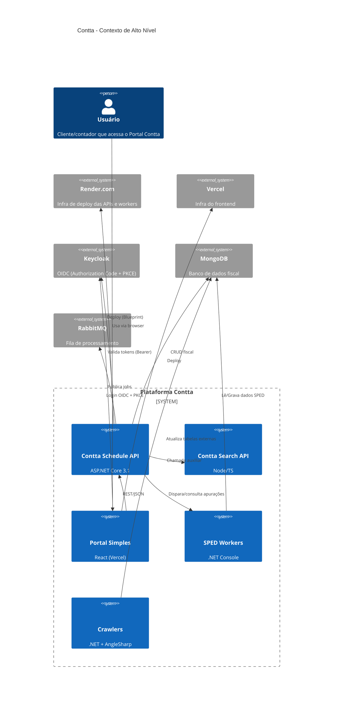
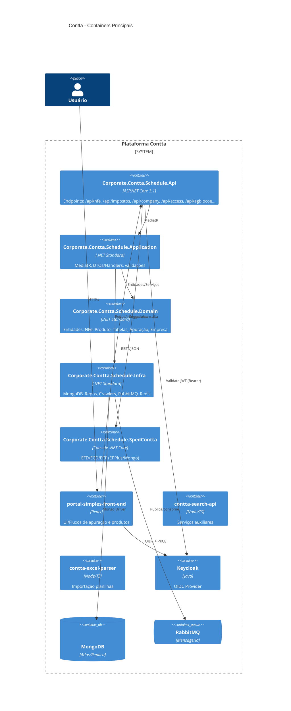
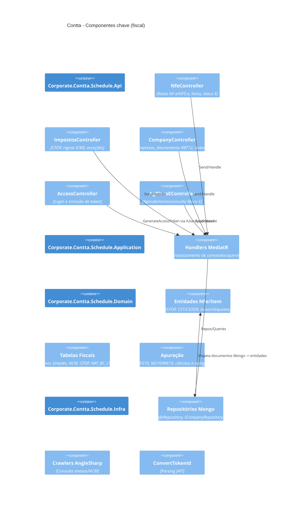

# C4: Context, Containers e Componentes (Módulos Fiscais Contta)

> Visão gerada automaticamente a partir do inventário do monorepo. Ajuste nomes/URLs conforme deploy final (Render/Vercel/Keycloak).

## C4-Context

## C4-Container

## C4-Component (foco fiscal)

