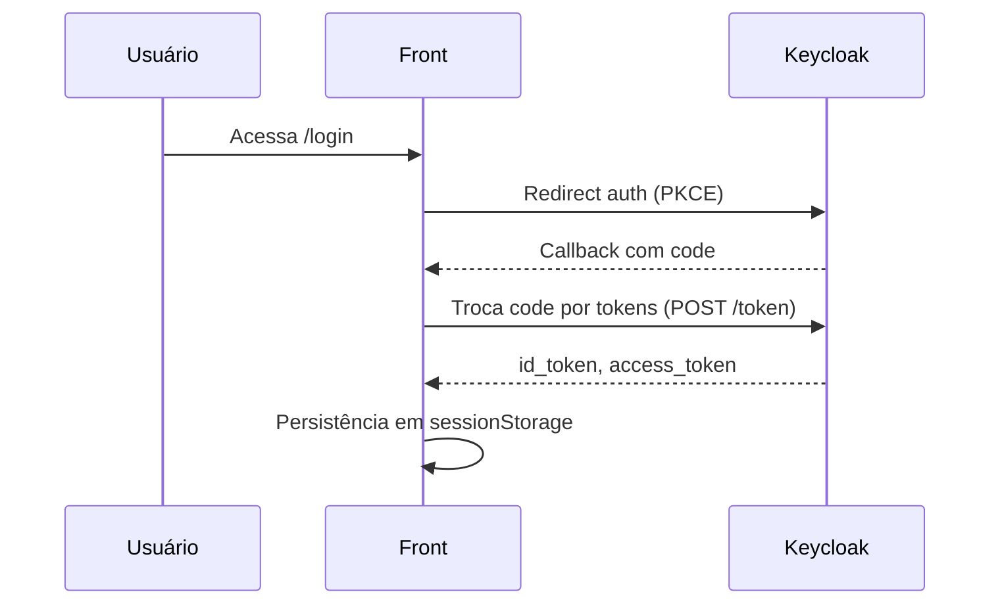

# Autenticação e Autorização (Keycloak OIDC + PKCE)

## Fluxo
1. Login: `/login` cria code_verifier/challenge (PKCE) e redireciona para `${issuer}/protocol/openid-connect/auth`
2. Callback: `/auth/callback` troca `code` → tokens no `${issuer}/protocol/openid-connect/token`
3. Persistência: `sessionStorage` salva `id_token` e `access_token`
4. Proteção de rotas: não há guard/middleware no projeto; páginas são públicas
5. Claims/Roles: não há leitura de roles ainda

## Arquivos e pontos
- Login: `contta-website-main/contta-website-main/src/pages/login.tsx` (vars issuer/clientId; construir URL OIDC; salvar pkce_verifier)
- Callback: `contta-website-main/contta-website-main/src/pages/auth/callback.tsx` (fetch token, validação resp.ok, salvar tokens)
- PKCE util: `contta-website-main/contta-website-main/src/utils/pkce.ts` (createCodeVerifier/Challenge)
- Variáveis públicas: `contta-website-main/contta-website-main/.env.example` (NEXT_PUBLIC_OIDC_ISSUER, NEXT_PUBLIC_OIDC_CLIENT_ID)

## Parametrização (sem segredos)
Variável | Descrição | Onde usada
---|---|---
NEXT_PUBLIC_OIDC_ISSUER | Base do realm do Keycloak (ex: https://id.e-contta.com.br/realms/contta) | login.tsx, auth/callback.tsx
NEXT_PUBLIC_OIDC_CLIENT_ID | Client ID público do front | login.tsx, auth/callback.tsx
NEXT_PUBLIC_API_URL | Base para chamadas às APIs (futuro) | consumo de APIs no front

## Diagrama Mermaid

