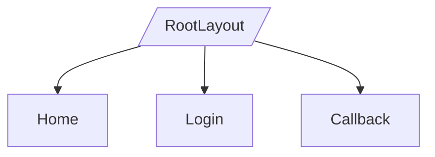

# Layouts, Navegação e Rotas

## 1) Layouts
| Layout | Caminho | Altura header | Largura sidebar | Spacing padrão | Sombra/Radius | Z-Index | Observações |
|---|---|---|---|---|---|---|---|
| RootLayout | `src/components/Layout/*` | variável por conteúdo | - | locais | leves | 2 (Header) | Header fixo com shadow ao scroll |

## 2) Hierarquia de rotas (pages)
| Rota | Componente/Página | Breadcrumb | Guard/Proteção | Observações |
|---|---|---|---|---|
| `/` | `src/pages/index.tsx` | Home | Pública | Com Sections: Landing, OurGoal, Services, Contacts |
| `/login` | `src/pages/login.tsx` | Login | Pública | Redireciona para OIDC + PKCE |
| `/auth/callback` | `src/pages/auth/callback.tsx` | Callback | Pública | Troca code→token e redireciona `/` |

## 3) Diagrama Mermaid

## 4) Navegação e estados
- Âncoras com react-scroll: `#services`, `#goal`, `#contacts`
- Links ativos: manejados por react-scroll; sem breadcrumbs globais
- Fallbacks: páginas de erro não customizadas (padrão Next)
