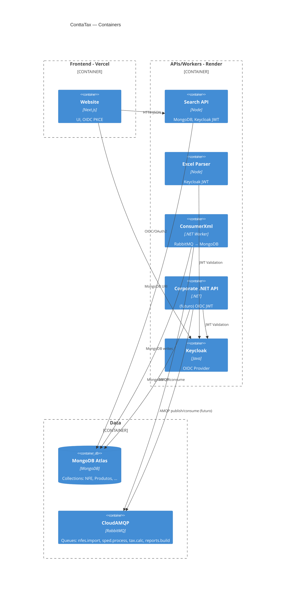

# Mapa de Infra

## Artefatos encontrados
- Render blueprint: `./render.yaml`
- Dockerfiles: múltiplos (API .NET, Node APIs, Website, ConsumerXml, Keycloak em `./.docker/keycloak/Dockerfile`)
- Docker Compose: `./docker-compose.yml` (RabbitMQ, Mongo, Keycloak, services Node)
- appsettings*.json: APIs .NET
- .env.example: front/Node (website, search-api, excel-parser, portal-simples)
- CI: `.gitlab-ci.yml` (alguns projetos); não há `.github/workflows`.

## Provedores
- Vercel: Frontend (Next.js)
- Render: APIs/Workers/Keycloak
- Atlas (MongoDB): DB gerenciado
- CloudAMQP: RabbitMQ gerenciado
- Keycloak: Auth OIDC + PKCE

## Portas/healthchecks (observado)
- Website: 3000 (Next.js)
- Search API: 5001
- Excel Parser: 5002
- Keycloak: 8080
- RabbitMQ: 5672/15672

## Diagrama (C4-Container)

## Onde estão
- Dockerfiles: ver `contta-website-main/**/Dockerfile`, `contta-search-api-main/**/Dockerfile`, `contta-excel-parser-main/**/Dockerfile`, `agendador-back-end-master/**/Dockerfile`, `./.docker/keycloak/Dockerfile`.
- ENV: `.env.example` nos projetos web e `docker-compose.yml` (envs de serviços).
- render.yaml: raiz.
